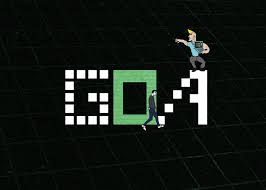

  

# Hi there! 👋

## I'm Tsotne Gujabidze, a Leader at Goal Oriented Academy (GOA) 🎓

### About Me ℹ️
- 🌟 Current Rank: Mentor's Assistant
- 🎂 Age: 14 years old
- 🚀 Skills: Python, HTML5, CSS3, JavaScript

### What I Do 🌟
- 📚 Lead and mentor students at GOA
- 💻 Teach Python, HTML, CSS and JavaScript
- 🌐 Create projects that inspire and educate

### Connect with Me 🌍

  &nbsp;&nbsp;
  

 

